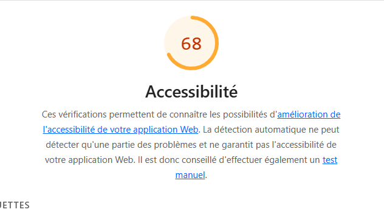

# Q1: Quels sont les arguments que vous pouvez utiliser pour convaincre votre Client de rendre son quizz accessible ? (Vous pouvez vous aider du cour)
Réponse: L'accessibilité d'un site offre une meilleure SEO, et différentes lois demandent une meilleure accessibilité des sites WEB / applications pour ne pas faire de discrimination envers les personnes ayant des handicaps

# Q2: Ajouter le screen de votre score :
Screen:

# Q3: Est-ce que l'analyse de Lighthouse est suffisante pour évaluer l'Accessibilité de votre Application ?
Réponse:
Clairement pas, pour évaluer clairement l'accessibilité d'un site, il faut passer directement par les clients en situation de handicap, comprendre leurs besoins et leurs nécessités

# Q4: Combien de fois vous devez utiliser une touche du clavier pour passer le quizz ?
Réponse: 27 fois

# Q5: Donner 3 roles ARIA et 3 propriété ARIA
Réponse:

# Q6: Ajouter le screen de votre score Lighthouse
Screen:

# Q7: L'une des best practice de l'ARIA est "ne pas utiliser l'ARIA" pouvez nous expliquer pourquoi d'après vous ?
Réponse:

# Q8: Ajouter le screen de votre score Lighthouse
Screen:

# Q9: Pourquoi le score de lighthouse n'a pas augmenté d'après vous ?
Réponse:

# Q10: Quel est la valeur du rapport de contraste actuel :
Réponse:

# Q11: Quel est la valeur du score AA :
Réponse:

# Q12: Quel est la valeur du score AAA :
Réponse:

# Q13: Comment pouvez vous changer la valeur du contraste de votre texte ?
Réponse:

# Q14: Ajouter le screen de votre score Lighthouse
Screen:

# Q15: Êtes vous capable de déterminer visuellement ce qui est un lien ou pas en appliquant chaque altérations ?
Réponse:

# Q16: Ajouter le screen de votre score Lighthouse
Screen:

# Q17:  Proposition 1
Description:
Nb d'actions gagnée : 

# Q18:  Proposition 2
Description:
Nb d'actions gagnée : 

# Q19:  Proposition 3
Description:
Nb d'actions gagnée : 
